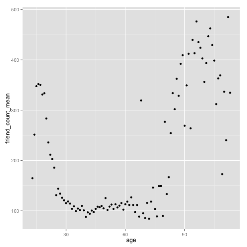

Lesson 4 (two variables)
========================================================

load the package and the data:

```r
library(ggplot2)
pf <- read.csv("~/programme/data_mining/R/Udacity/pseudo_facebook.tsv", sep = "\t", 
    header = TRUE, row.names = 1)
summary(pf)
```

```
##       age           dob_day        dob_year      dob_month    
##  Min.   : 13.0   Min.   : 1.0   Min.   :1900   Min.   : 1.00  
##  1st Qu.: 20.0   1st Qu.: 7.0   1st Qu.:1963   1st Qu.: 3.00  
##  Median : 28.0   Median :14.0   Median :1985   Median : 6.00  
##  Mean   : 37.3   Mean   :14.5   Mean   :1976   Mean   : 6.28  
##  3rd Qu.: 50.0   3rd Qu.:22.0   3rd Qu.:1993   3rd Qu.: 9.00  
##  Max.   :113.0   Max.   :31.0   Max.   :2000   Max.   :12.00  
##                                                               
##     gender          tenure      friend_count  friendships_initiated
##  female:40254   Min.   :   0   Min.   :   0   Min.   :   0         
##  male  :58574   1st Qu.: 226   1st Qu.:  31   1st Qu.:  17         
##  NA's  :  175   Median : 412   Median :  82   Median :  46         
##                 Mean   : 538   Mean   : 196   Mean   : 107         
##                 3rd Qu.: 675   3rd Qu.: 206   3rd Qu.: 117         
##                 Max.   :3139   Max.   :4923   Max.   :4144         
##                 NA's   :2                                          
##      likes       likes_received    mobile_likes   mobile_likes_received
##  Min.   :    0   Min.   :     0   Min.   :    0   Min.   :     0       
##  1st Qu.:    1   1st Qu.:     1   1st Qu.:    0   1st Qu.:     0       
##  Median :   11   Median :     8   Median :    4   Median :     4       
##  Mean   :  156   Mean   :   143   Mean   :  106   Mean   :    84       
##  3rd Qu.:   81   3rd Qu.:    59   3rd Qu.:   46   3rd Qu.:    33       
##  Max.   :25111   Max.   :261197   Max.   :25111   Max.   :138561       
##                                                                        
##    www_likes     www_likes_received
##  Min.   :    0   Min.   :     0    
##  1st Qu.:    0   1st Qu.:     0    
##  Median :    0   Median :     2    
##  Mean   :   50   Mean   :    59    
##  3rd Qu.:    7   3rd Qu.:    20    
##  Max.   :14865   Max.   :129953    
## 
```


scatter plot:

```r
qplot(x = age, y = friend_count, data = pf)
```

 


similar plot created by ggplot

```r
ggplot(aes(x = age, y = friend_count), data = pf) + geom_point()
```

 

```r
ggplot(aes(x = age, y = friend_count), data = pf) + geom_point() + xlim(13, 
    90)
```

```
## Warning: Removed 4906 rows containing missing values (geom_point).
```

 

```r

ggplot(aes(x = age, y = friend_count), data = pf) + geom_point(alpha = 1/20) + 
    xlim(13, 90)
```

```
## Warning: Removed 4906 rows containing missing values (geom_point).
```

 

```r

ggplot(aes(x = age, y = friend_count), data = pf) + geom_jitter(alpha = 1/20) + 
    xlim(13, 90)
```

```
## Warning: Removed 5185 rows containing missing values (geom_point).
```

 

```r

ggplot(aes(x = age, y = friend_count), data = pf) + geom_point(alpha = 1/20) + 
    xlim(13, 90) + coord_trans(y = "sqrt")
```

```
## Warning: Removed 4906 rows containing missing values (geom_point).
```

 

```r

ggplot(aes(x = age, y = friend_count), data = pf) + geom_point(alpha = 1/20, 
    position = position_jitter(h = 0)) + xlim(13, 90) + coord_trans(y = "sqrt")
```

```
## Warning: Removed 5172 rows containing missing values (geom_point).
```

 


friends initiated:

```r
ggplot(aes(x = age, y = friendships_initiated), data = pf) + geom_point(alpha = 1/20) + 
    xlim(13, 90) + coord_trans(y = "sqrt")
```

```
## Warning: Removed 4906 rows containing missing values (geom_point).
```

 


Create table with median using package dplyr:

```r
install.packages("dplyr")
```

```
## Error: trying to use CRAN without setting a mirror
```

```r
library(dplyr)
```

```
## 
## Attaching package: 'dplyr'
## 
## Die folgenden Objekte sind maskiert from 'package:stats':
## 
##     filter, lag
## 
## Die folgenden Objekte sind maskiert from 'package:base':
## 
##     intersect, setdiff, setequal, union
```

```r

age_groups <- group_by(pf, age)
pf.fc_by_age <- summarize(age_groups, friend_count_mean = mean(friend_count), 
    friend_count_median = median(friend_count), n = n())

pf.fc_by_age <- arrange(pf.fc_by_age, age)
head(pf.fc_by_age)
```

```
## Source: local data frame [6 x 4]
## 
##   age friend_count_mean friend_count_median    n
## 1  13             164.8                74.0  484
## 2  14             251.4               132.0 1925
## 3  15             347.7               161.0 2618
## 4  16             351.9               171.5 3086
## 5  17             350.3               156.0 3283
## 6  18             331.2               162.0 5196
```


Alternative using the chain of functions:

```r
pf.fc_by_age <- pf %.% group_by(age) %.% summarise(friend_count_mean = mean(friend_count), 
    friend_count_median = median(friend_count), n = n()) %.% arrange(age)

head(pf.fc_by_age)
```

```
## Source: local data frame [6 x 4]
## 
##   age friend_count_mean friend_count_median    n
## 1  13             164.8                74.0  484
## 2  14             251.4               132.0 1925
## 3  15             347.7               161.0 2618
## 4  16             351.9               171.5 3086
## 5  17             350.3               156.0 3283
## 6  18             331.2               162.0 5196
```


Plot the dependencies between age and mean friend count

```r
qplot(x = age, y = friend_count_mean, data = pf.fc_by_age)
```

 

```r
ggplot(aes(x = age, y = friend_count_mean), data = pf.fc_by_age, xlim = c(13, 
    110)) + geom_line()
```

 


Overlay of different plots:

```r
ggplot(aes(x = age, y = friend_count), data = pf) + xlim(13, 90) + geom_point(alpha = 0.05, 
    position = position_jitter(h = 0), color = "orange") + coord_trans(y = "sqrt") + 
    geom_line(stat = "summary", fun.y = mean) + geom_line(stat = "summary", 
    fun.y = quantile, probs = 0.1, linetype = 2, color = "blue") + geom_line(stat = "summary", 
    fun.y = quantile, probs = 0.5, linetype = 1, color = "blue") + geom_line(stat = "summary", 
    fun.y = quantile, probs = 0.9, linetype = 2, color = "blue")
```

```
## Warning: Removed 4906 rows containing missing values (stat_summary).
## Warning: Removed 4906 rows containing missing values (stat_summary).
## Warning: Removed 4906 rows containing missing values (stat_summary).
## Warning: Removed 4906 rows containing missing values (stat_summary).
## Warning: Removed 5188 rows containing missing values (geom_point).
```

 


Lesson zooming in using coord_cartesian:

```r
ggplot(aes(x = age, y = friend_count), data = pf) + coord_cartesian(xlim = c(13, 
    90), ylim = c(0, 1000)) + geom_point(alpha = 0.05, position = position_jitter(h = 0), 
    color = "orange") + geom_line(stat = "summary", fun.y = mean) + geom_line(stat = "summary", 
    fun.y = quantile, probs = 0.1, linetype = 2, color = "blue") + geom_line(stat = "summary", 
    fun.y = quantile, probs = 0.5, linetype = 1, color = "blue") + geom_line(stat = "summary", 
    fun.y = quantile, probs = 0.9, linetype = 2, color = "blue")
```

 


