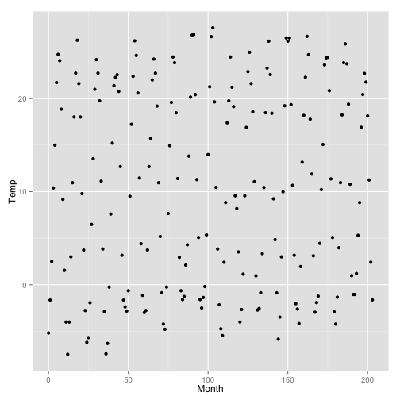
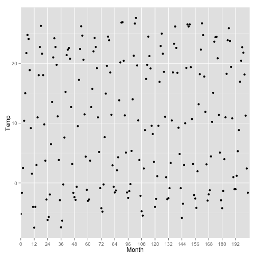

Lesson 4.2
========================================================

Data from Mitchell soil temperature

```r
install.packages("alr3")
```

```
## Error: trying to use CRAN without setting a mirror
```

```r
library(ggplot2)
library(car)
library(alr3)
data(Mitchell)
`?`(Mitchell)
summary(Mitchell)
```

```
##      Month            Temp       
##  Min.   :  0.0   Min.   :-7.478  
##  1st Qu.: 50.8   1st Qu.:-0.349  
##  Median :101.5   Median :10.450  
##  Mean   :101.5   Mean   :10.313  
##  3rd Qu.:152.2   3rd Qu.:20.431  
##  Max.   :203.0   Max.   :27.606
```


Scatterplot of temperature vs. month

```r
names(Mitchell)
```

```
## [1] "Month" "Temp"
```

```r
ggplot(aes(y = Temp, x = Month), data = Mitchell) + geom_point()
```

 


Correlation

```r
cor.test(Mitchell$Temp, Mitchell$Month, method = "pearson")
```

```
## 
## 	Pearson's product-moment correlation
## 
## data:  Mitchell$Temp and Mitchell$Month
## t = 0.8182, df = 202, p-value = 0.4142
## alternative hypothesis: true correlation is not equal to 0
## 95 percent confidence interval:
##  -0.08054  0.19332
## sample estimates:
##     cor 
## 0.05747
```


X-Axis with breaks every 12 months

```r
range(Mitchell$Month)
```

```
## [1]   0 203
```

```r
ggplot(aes(y = Temp, x = Month), data = Mitchell) + geom_point() + scale_x_discrete(breaks = seq(0, 
    203, 12))
```

 


## understanding noise: age to age months:

