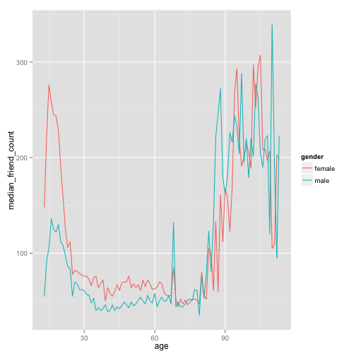

Lesson 5 Reshaping the data
========================================================

loading the data

```r
library(ggplot2)
pf <- read.csv("~/programme/data_mining/R/Udacity/pseudo_facebook.tsv", sep = "\t", 
    header = TRUE, row.names = 1)
summary(pf)
```

```
##       age           dob_day        dob_year      dob_month    
##  Min.   : 13.0   Min.   : 1.0   Min.   :1900   Min.   : 1.00  
##  1st Qu.: 20.0   1st Qu.: 7.0   1st Qu.:1963   1st Qu.: 3.00  
##  Median : 28.0   Median :14.0   Median :1985   Median : 6.00  
##  Mean   : 37.3   Mean   :14.5   Mean   :1976   Mean   : 6.28  
##  3rd Qu.: 50.0   3rd Qu.:22.0   3rd Qu.:1993   3rd Qu.: 9.00  
##  Max.   :113.0   Max.   :31.0   Max.   :2000   Max.   :12.00  
##                                                               
##     gender          tenure      friend_count  friendships_initiated
##  female:40254   Min.   :   0   Min.   :   0   Min.   :   0         
##  male  :58574   1st Qu.: 226   1st Qu.:  31   1st Qu.:  17         
##  NA's  :  175   Median : 412   Median :  82   Median :  46         
##                 Mean   : 538   Mean   : 196   Mean   : 107         
##                 3rd Qu.: 675   3rd Qu.: 206   3rd Qu.: 117         
##                 Max.   :3139   Max.   :4923   Max.   :4144         
##                 NA's   :2                                          
##      likes       likes_received    mobile_likes   mobile_likes_received
##  Min.   :    0   Min.   :     0   Min.   :    0   Min.   :     0       
##  1st Qu.:    1   1st Qu.:     1   1st Qu.:    0   1st Qu.:     0       
##  Median :   11   Median :     8   Median :    4   Median :     4       
##  Mean   :  156   Mean   :   143   Mean   :  106   Mean   :    84       
##  3rd Qu.:   81   3rd Qu.:    59   3rd Qu.:   46   3rd Qu.:    33       
##  Max.   :25111   Max.   :261197   Max.   :25111   Max.   :138561       
##                                                                        
##    www_likes     www_likes_received
##  Min.   :    0   Min.   :     0    
##  1st Qu.:    0   1st Qu.:     0    
##  Median :    0   Median :     2    
##  Mean   :   50   Mean   :    59    
##  3rd Qu.:    7   3rd Qu.:    20    
##  Max.   :14865   Max.   :129953    
## 
```


Third option for qualitative variables:

```r
library("dplyr")
```

```
## 
## Attaching package: 'dplyr'
## 
## Die folgenden Objekte sind maskiert from 'package:stats':
## 
##     filter, lag
## 
## Die folgenden Objekte sind maskiert from 'package:base':
## 
##     intersect, setdiff, setequal, union
```

```r

pf.fc_by_age_gender <- pf %.% filter(!is.na(gender)) %.% group_by(age, gender) %.% 
    summarize(mean_friend_count = mean(friend_count), median_friend_count = median(friend_count), 
        n = n()) %.% ungroup() %.% arrange(age)

head(pf.fc_by_age_gender)
```

```
## Source: local data frame [6 x 5]
## 
##   age gender mean_friend_count median_friend_count    n
## 1  13 female             259.2                 148  193
## 2  13   male             102.1                  55  291
## 3  14 female             362.4                 224  847
## 4  14   male             164.1                  92 1078
## 5  15 female             538.7                 276 1139
## 6  15   male             200.7                 106 1478
```


Plotting third qualitative variable:

```r
ggplot(aes(x = age, y = median_friend_count), data = pf.fc_by_age_gender) + 
    geom_line(aes(color = gender))
```

 


Reshaping the data using the dcast function. Result will be a new data frame. The acast function will be used when the result shall be a list or an array. 

```r
install.packages("reshape2")
```

```
## Error: trying to use CRAN without setting a mirror
```

```r
library(reshape2)

pf.fc_by_age_gender.wide <- dcast(pf.fc_by_age_gender, age ~ gender, value.var = "median_friend_count")
```


Plot the ratio of the female to male median friend counts using the new data frame:

```r
ggplot(aes(x = age, y = (female/male)), data = pf.fc_by_age_gender.wide) + geom_line() + 
    geom_hline(yintercept = 1, alpha = 0.3, linetype = 2)
```

 


Adding a new variable to the data frame for time sind logged on to fb

```r
pf["year_joined"] <- NA
pf$year_joined <- floor((2014 * 365 - pf$tenure)/365)

summary(pf$year_joined)
```

```
##    Min. 1st Qu.  Median    Mean 3rd Qu.    Max.    NA's 
##    2000    2010    2010    2010    2010    2010       2
```

```r
table(pf$year_joined)
```

```
## 
##  2005  2006  2007  2008  2009  2010  2011  2012  2013  2014 
##     9    15   581  1507  4557  5448  9860 33366 43588    70
```


cut the data into buckets using the cut function:

```r
pf$year_joined.bucket <- cut(pf$year_joined, c(2004, 2009, 2011, 2012, 2014))
head(pf$year_joined.bucket)
```

```
## [1] (2012,2014] (2012,2014] (2012,2014] (2012,2014] (2012,2014] (2012,2014]
## Levels: (2004,2009] (2009,2011] (2011,2012] (2012,2014]
```

```r
table(pf$year_joined.bucket, useNA = "ifany")
```

```
## 
## (2004,2009] (2009,2011] (2011,2012] (2012,2014]        <NA> 
##        6669       15308       33366       43658           2
```


