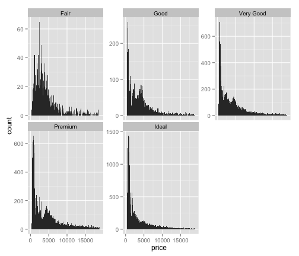
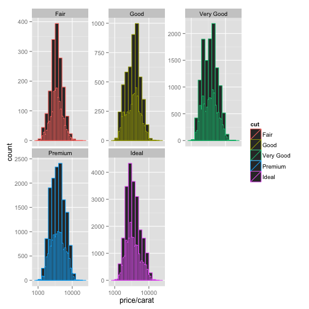
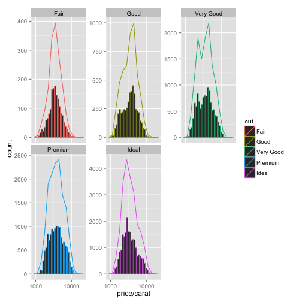

Udacity lessen 4
========================================================

```r
install.packages("ggplot2")
```

```
## Error: trying to use CRAN without setting a mirror
```

```r
library(ggplot2)
```


This is an R Markdown document. Markdown is a simple formatting syntax for authoring web pages (click the **MD** toolbar button for help on Markdown).

When you click the **Knit HTML** button a web page will be generated that includes both content as well as the output of any embedded R code chunks within the document. You can embed an R code chunk like this:


```r
qplot(x = price, data = diamonds) + facet_wrap(~cut)
```

```
## stat_bin: binwidth defaulted to range/30. Use 'binwidth = x' to adjust this.
## stat_bin: binwidth defaulted to range/30. Use 'binwidth = x' to adjust this.
## stat_bin: binwidth defaulted to range/30. Use 'binwidth = x' to adjust this.
## stat_bin: binwidth defaulted to range/30. Use 'binwidth = x' to adjust this.
## stat_bin: binwidth defaulted to range/30. Use 'binwidth = x' to adjust this.
```

 


You can also embed plots, for example:


```r
qplot(x = price, data = diamonds, binwidth = 100) + facet_wrap(~cut, scales = "free_y")
```

 


```r
qplot(x = price/carat, data = diamonds, binwidth = 0.1, color = cut) + geom_histogram() + 
    scale_x_log10() + facet_wrap(~cut, scales = "free_y")
```

```
## stat_bin: binwidth defaulted to range/30. Use 'binwidth = x' to adjust this.
## stat_bin: binwidth defaulted to range/30. Use 'binwidth = x' to adjust this.
## stat_bin: binwidth defaulted to range/30. Use 'binwidth = x' to adjust this.
## stat_bin: binwidth defaulted to range/30. Use 'binwidth = x' to adjust this.
## stat_bin: binwidth defaulted to range/30. Use 'binwidth = x' to adjust this.
```

 


```r
qplot(x = price/carat, data = diamonds, binwidth = 0.1, color = cut, geom = "freqpoly") + 
    geom_histogram() + scale_x_log10() + facet_wrap(~cut, scales = "free_y")
```

```
## stat_bin: binwidth defaulted to range/30. Use 'binwidth = x' to adjust this.
## stat_bin: binwidth defaulted to range/30. Use 'binwidth = x' to adjust this.
## stat_bin: binwidth defaulted to range/30. Use 'binwidth = x' to adjust this.
## stat_bin: binwidth defaulted to range/30. Use 'binwidth = x' to adjust this.
## stat_bin: binwidth defaulted to range/30. Use 'binwidth = x' to adjust this.
```

 


