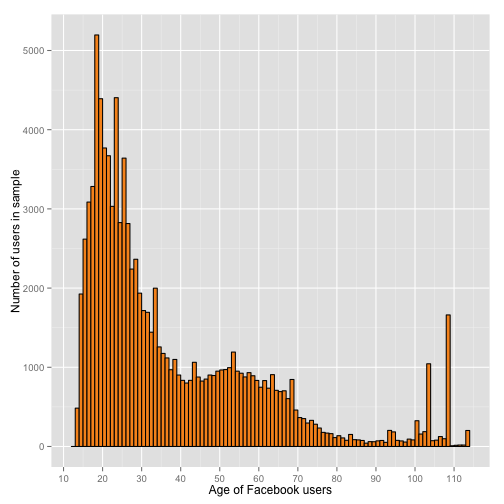

Udacity Lesson 3
========================================================

Markdown including all commands for lesson 3 of the Exploratory Data Analysis Course at Udacity.

Check the current working directory and list files:

```r
getwd()
```

```
## [1] "/Users/gerd/programme/data_mining/R/Udacity"
```

```r
list.files()
```

```
##  [1] "demystifying.R"          "demystifyingR2.html"    
##  [3] "demystifyingR2.md"       "demystifyingR2.Rmd"     
##  [5] "figure"                  "lessong3.html"          
##  [7] "lessong3.md"             "lessong3.Rmd"           
##  [9] "pseudo_facebook.tsv"     "reddit.csv"             
## [11] "stateData.csv"           "udacity_course.R"       
## [13] "What_is_a_RMD_file.html" "What_is_a_RMD_file.md"  
## [15] "What_is_a_RMD_file.Rmd"
```


Read the data from the file: 

```r
pf <- read.csv("pseudo_facebook.tsv", sep = "\t")
```


Check the variables by using the names command:

```r
names(pf)
```

```
##  [1] "userid"                "age"                  
##  [3] "dob_day"               "dob_year"             
##  [5] "dob_month"             "gender"               
##  [7] "tenure"                "friend_count"         
##  [9] "friendships_initiated" "likes"                
## [11] "likes_received"        "mobile_likes"         
## [13] "mobile_likes_received" "www_likes"            
## [15] "www_likes_received"
```


Histrogram of Users birthdays 1:

```r
library(ggplot2)
```

```
## Warning: package 'ggplot2' was built under R version 3.0.2
```

```r
qplot(x = dob_day, data = pf)
```

```
## stat_bin: binwidth defaulted to range/30. Use 'binwidth = x' to adjust
## this.
```

 


Histrogram of Users birthdays 2 with days of month on the x-axis:

```r
library(ggplot2)
qplot(x = dob_day, data = pf) + scale_x_discrete(breaks = 1:31)
```

 


Histrogram of Users birthdays 3:

```r
library(ggplot2)
qplot(x = dob_day, data = pf) + scale_x_discrete(breaks = 1:31) + facet_wrap(~dob_month, 
    ncol = 3)
```

 


Histogram of freind counts:

```r
qplot(x = friend_count, data = pf)
```

```
## stat_bin: binwidth defaulted to range/30. Use 'binwidth = x' to adjust
## this.
```

 


Histogram of freind counts with limitation of the x axis:

```r
qplot(x = friend_count, data = pf, binwidth = 25, xlim = c(0, 1000))
```

 


Histogram of freind counts with limitation of the x axis:

```r
qplot(x = friend_count, data = pf, binwidth = 25) + scale_x_continuous(limits = c(0, 
    1000), breaks = seq(0, 1000, 50))
```

 


Histogram of freind counts with limitation of the x axis with differentiation of gender:

```r
qplot(x = friend_count, data = pf, binwidth = 25) + scale_x_continuous(limits = c(0, 
    1000), breaks = seq(0, 1000, 50)) + facet_wrap(~gender, ncol = 3)
```

 


Histogram of freind counts with limitation of the x axis with differentiation of gender omitting NA observations:

```r
qplot(x = friend_count, data = subset(pf, !is.na(gender)), binwidth = 25) + 
    scale_x_continuous(limits = c(0, 1000), breaks = seq(0, 1000, 50)) + facet_wrap(~gender, 
    ncol = 3)
```

 


Statistics by gender

```r
table(pf$gender)
```

```
## 
## female   male 
##  40254  58574
```

```r
by(pf$friend_count, pf$gender, summary)
```

```
## pf$gender: female
##    Min. 1st Qu.  Median    Mean 3rd Qu.    Max. 
##       0      37      96     242     244    4920 
## -------------------------------------------------------- 
## pf$gender: male
##    Min. 1st Qu.  Median    Mean 3rd Qu.    Max. 
##       0      27      74     165     182    4920
```


Tenure by month (30 days):

```r
qplot(x = tenure, data = pf, color=I("black"), fill=I('#099DD9'), binwidth = 30)
```

 


Tenure by year (365 days):

```r
qplot(x = tenure/365, data = pf, 
      xlab="Number of years using Facebook",
      ylab="Number of users in sample",
      color=I("black"), fill=I('#F79420'), binwidth = .25) +
  scale_x_continuous(breaks = seq(1,7,1), limits=c(0,7)) 
```

 


Users by age:

```r
qplot(x = age, data = pf, 
      xlab="Age of Facebook users",
      ylab="Number of users in sample",
      color=I("black"), fill=I('#F79420'), binwidth = 1) +
  scale_x_continuous(breaks = seq(0,200,10))
```

 


Various plots using gridExtra:

```r
# load library gridExtra
library(gridExtra)
```

```
## Warning: package 'gridExtra' was built under R version 3.0.2
```

```
## Loading required package: grid
```

```r

# define individual plots
plot1 <- qplot(x = friend_count, data = pf, binwidth = 10, xlim = c(0, 1000))
plot2 <- qplot(x = log10(friend_count + 1), data = pf, binwidth = 0.05, xlim = c(0, 
    5))
plot3 <- qplot(x = sqrt(friend_count), data = pf, binwidth = 0.25, xlim = c(0, 
    50))

# arrange plots in grid
grid.arrange(plot1, plot2, plot3, ncol = 2)
```

 


Second variation for log-based x-axis:

```r
logScale <- qplot(x = log10(friend_count + 1), data = pf, binwidth = 0.05)

countScale <- ggplot(aes(x = friend_count), data = pf) + geom_histogram() + 
    scale_x_log10()

logScale2 <- qplot(x = friend_count, data = pf) + scale_x_log10()

grid.arrange(logScale, countScale, logScale2, ncol = 1)
```

```
## stat_bin: binwidth defaulted to range/30. Use 'binwidth = x' to adjust
## this.
```

```
## stat_bin: binwidth defaulted to range/30. Use 'binwidth = x' to adjust
## this.
```

 


Frequency polygons:

```r
qplot(x = friend_count, data = subset(pf, !is.na(gender)), binwidth = 10) + 
    scale_x_continuous(lim = c(0, 1000), breaks = seq(0, 1000, 50)) + facet_wrap(~gender)
```

 

```r

qplot(x = friend_count, y = ..count../sum(..count..), data = subset(pf, !is.na(gender)), 
    xlab = "Friend Count", ylab = "Proporation of Users with that friend count", 
    binwidth = 10, geom = "freqpoly", color = gender) + scale_x_continuous(lim = c(0, 
    1000), breaks = seq(0, 1000, 50))
```

```
## Warning: Removed 2 rows containing missing values (geom_path).
```

```
## Warning: Removed 2 rows containing missing values (geom_path).
```

 

```r

```


Frequency polygon of www_likes:

```r
likesScale <- qplot(x = www_likes, data = subset(pf, !is.na(gender)), xlab = "WWW Likes", 
    ylab = "Number of users", binwidth = 100, geom = "freqpoly", color = gender) + 
    scale_x_continuous(lim = c(20, 1500), breaks = seq(20, 1500, 100))

likesLog <- qplot(x = www_likes, data = subset(pf, !is.na(gender)), xlab = "WWW Likes", 
    ylab = "Number of users", geom = "freqpoly", color = gender) + scale_x_log10()

grid.arrange(likesScale, likesLog, ncol = 1)
```

```
## Warning: Removed 2 rows containing missing values (geom_path).
```

```
## Warning: Removed 2 rows containing missing values (geom_path).
```

```
## stat_bin: binwidth defaulted to range/30. Use 'binwidth = x' to adjust
## this.
```

 


Statistics totals of www_likes

```r
# table(pf$www_likes)
by(pf$www_likes, pf$gender, sum)
```

```
## pf$gender: female
## [1] 3507665
## -------------------------------------------------------- 
## pf$gender: male
## [1] 1430175
```


Box-plots:

```r
option1 <- qplot(x = gender, y = friend_count, data = subset(pf, !is.na(gender)), 
    geom = "boxplot", color = gender, ylim = c(0, 1000))

option2 <- qplot(x = gender, y = friend_count, data = subset(pf, !is.na(gender)), 
    geom = "boxplot", color = gender) + scale_y_continuous(lim = c(0, 1000), 
    breaks = seq(0, 1000, 100))

option3 <- qplot(x = gender, y = friend_count, data = subset(pf, !is.na(gender)), 
    geom = "boxplot", color = gender) + coord_cartesian(ylim = c(0, 1000))

grid.arrange(option1, option2, option3, ncol = 1)
```

```
## Warning: Removed 2949 rows containing non-finite values (stat_boxplot).
```

```
## Warning: Removed 2949 rows containing non-finite values (stat_boxplot).
```

 


Friend count analysis using boxplot and summary:

```r
qplot(x = gender, y = friend_count, data = subset(pf, !is.na(gender)), geom = "boxplot", 
    color = gender) + coord_cartesian(ylim = c(0, 250))
```

 

```r

by(pf$friend_count, pf$gender, summary)
```

```
## pf$gender: female
##    Min. 1st Qu.  Median    Mean 3rd Qu.    Max. 
##       0      37      96     242     244    4920 
## -------------------------------------------------------- 
## pf$gender: male
##    Min. 1st Qu.  Median    Mean 3rd Qu.    Max. 
##       0      27      74     165     182    4920
```


Friendships initiated analysis using boxplot and summary:

```r
qplot(x = gender, y = friendships_initiated, data = subset(pf, !is.na(gender)), 
    geom = "boxplot", color = gender) + coord_cartesian(ylim = c(0, 250))
```

 

```r

by(pf$friendships_initiated, pf$gender, summary)
```

```
## pf$gender: female
##    Min. 1st Qu.  Median    Mean 3rd Qu.    Max. 
##       0      19      49     114     125    3650 
## -------------------------------------------------------- 
## pf$gender: male
##    Min. 1st Qu.  Median    Mean 3rd Qu.    Max. 
##       0      15      44     103     111    4140
```


Using additional variables:

```r
summary(pf$mobile_likes)
```

```
##    Min. 1st Qu.  Median    Mean 3rd Qu.    Max. 
##       0       0       4     106      46   25100
```

```r
summary(pf$mobile_likes > 0)
```

```
##    Mode   FALSE    TRUE    NA's 
## logical   35056   63947       0
```

```r

mobile_check_in <- NA
pf$mobile_check_in <- ifelse(pf$mobile_likes > 0, 1, 0)
pf$mobile_check_in <- factor(pf$mobile_check_in)
summary(pf$mobile_check_in)
```

```
##     0     1 
## 35056 63947
```

```r
sum(pf$mobile_check_in == 1)/length(pf$mobile_check_in)
```

```
## [1] 0.6459
```


